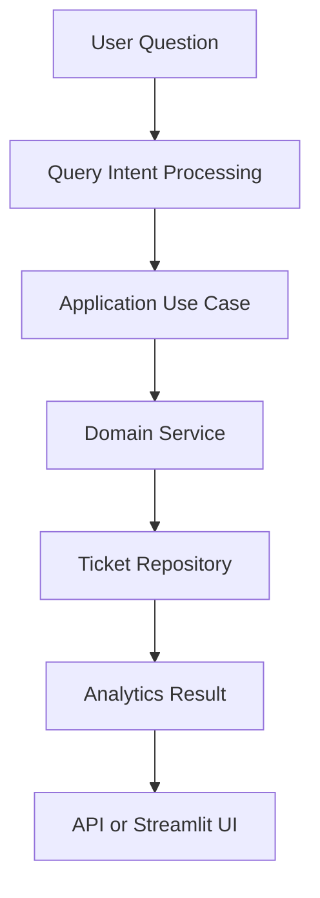

# Support Ticket AI

Support Ticket AI is a Python-based application that helps users analyze support ticket data using natural language questions.

The project uses FastAPI for the backend, Streamlit for the user interface, and Ollama for local LLM-based query understanding.

I developed this project as part of a technical assessment to analyze ticket details, agent performance, customer ratings, and ticket resolution issues.

## Features

- Ask support ticket questions using natural language
- Count open and filtered tickets
- Calculate average customer ratings
- Find the agent who resolved the most tickets
- Find agents with the lowest average ratings
- Analyze monthly ticket resolution
- Identify critical tickets that were not resolved within a specific time
- Detect long resolution times
- Detect unresolved high-priority tickets
- REST API using FastAPI
- Interactive interface using Streamlit
- Local LLM integration using Ollama
- Automated tests using Pytest

## Tech Stack

- Python 3.13+
- FastAPI
- Streamlit
- Pandas
- Pydantic
- Ollama
- Llama 3.2
- Pytest
- HTTPX

## Project Structure

```text
support-ticket-ai/
├── app/
│   ├── domain/
│   │   ├── entities/
│   │   ├── repositories/
│   │   └── services/
│   ├── application/
│   │   ├── dto/
│   │   ├── ports/
│   │   └── use_cases/
│   ├── infrastructure/
│   │   ├── anomaly/
│   │   ├── llm/
│   │   └── repositories/
│   └── presentation/
│       ├── api/
│       └── schemas/
├── data/
│   └── support_tickets.csv
├── tests/
├── ui/
│   └── app.py
├── main.py
├── requirements.txt
├── .gitignore
└── README.md
```

### Folder Description

| Folder | Description |
|---|---|
| `domain` | Contains entities, repository interfaces, and business logic |
| `application` | Contains use cases, DTOs, and application interfaces |
| `infrastructure` | Contains CSV repository and Ollama integration |
| `presentation` | Contains FastAPI routes and schemas |
| `tests` | Contains project tests and LLM query testing scripts |
| `ui` | Contains the Streamlit application |
| `data` | Contains the support ticket CSV dataset |

## How to Run the Project

### Requirements

Before running the project, install:

- Python 3.13 or above
- Git
- Ollama

### 1. Clone the Repository

```bash
git clone https://github.com/purushothaman1727/support-ticket-ai.git
```

Move into the project folder:

```bash
cd support-ticket-ai
```

### 2. Create a Virtual Environment

```bash
python -m venv venv
```

### 3. Activate the Virtual Environment

For Windows PowerShell:

```powershell
.\venv\Scripts\Activate.ps1
```

### 4. Install Dependencies

```bash
pip install -r requirements.txt
```

## Ollama Setup

This project uses Ollama for local language model integration.

Install Ollama from:

https://ollama.com/

Download the required model:

```bash
ollama pull llama3.2
```

Start Ollama if it is not already running:

```bash
ollama serve
```

Create a `.env` file in the project root:

```env
OLLAMA_BASE_URL=http://localhost:11434
OLLAMA_MODEL=llama3.2
OLLAMA_TIMEOUT=60
```

The `.env` file is excluded from Git using `.gitignore`.

## Running the Application

### Start the FastAPI Backend

Open a terminal in the project directory and run:

```powershell
uvicorn main:app --reload
```

Backend URL:

```text
http://127.0.0.1:8000
```

Swagger API documentation:

```text
http://127.0.0.1:8000/docs
```

### Start the Streamlit UI

Open another terminal, activate the virtual environment, and run:

```powershell
python -m streamlit run ui/app.py
```

Streamlit application:

```text
http://localhost:8501
```

## Example Questions

The application supports questions such as:

- How many open tickets are there?
- What is the average customer rating for Technical tickets?
- Which agent resolved the most tickets?
- Which agent has the lowest average rating?
- Which agent resolved the most tickets this month?
- How many critical tickets were not resolved within 12 hours?
- Show resolution time anomalies this week.

## API Endpoints

| Method | Endpoint | Purpose |
|---|---|---|
| GET | `/health` | Checks whether the API is running |
| POST | `/api/query` | Processes a natural language ticket query |
| GET | `/api/anomalies` | Returns detected ticket anomalies |

The complete request and response schemas can be viewed in the Swagger documentation:

```text
http://127.0.0.1:8000/docs
```

## Sample Results

The following results were obtained while testing the application with the current dataset.

| Query | Result |
|---|---|
| Open tickets | 111 |
| Average rating for Technical tickets | 3.74 |
| Most resolved agents | AGT-09 and AGT-12, with 37 tickets each |
| Lowest average rating | AGT-08 and AGT-11, with an average of 3.48 |
| Most resolved agent in March 2024 | AGT-01, with 16 tickets |
| Critical tickets not resolved within 12 hours | 31 |

These results depend on the current CSV dataset.

## Anomaly Detection

The application checks for two main types of ticket anomalies:

### 1. Long Resolution Times

Tickets with unusually high resolution times are identified based on the implemented detection logic.

### 2. Unresolved High-Priority Tickets

The application identifies unresolved high-priority tickets that have exceeded the configured age threshold.

### Time-Based Analysis

The dataset contains historical ticket records. Therefore, some time-based calculations use the latest timestamp available in the dataset as a reference.

For this reason, results for queries such as "this month" and ticket age calculations are relative to the dataset and not necessarily the current date.

## Architecture

The project uses a DDD-inspired structure to keep business logic separate from external dependencies.

- **Domain:** Contains ticket entities, repository interfaces, and business services.
- **Application:** Contains use cases and application-level interfaces.
- **Infrastructure:** Handles CSV data access and Ollama integration.
- **Presentation:** Provides FastAPI endpoints and request/response schemas.

### Query Flow



## Testing

Run the project tests using:

```powershell
pytest -q
```

To test natural language intent extraction:

```powershell
python -m tests.run_llm_query
```

The tests cover ticket ingestion, query processing, and LLM query intent validation.

## Design Decisions

### CSV Repository

The current project uses a CSV file as the data source because the assessment provides a CSV dataset and the application is intended for local analysis.

### Ollama

Ollama is used to run the LLM locally without depending on a paid external API.

### Layered Structure

The project separates domain logic, application use cases, infrastructure, and API presentation to make the code easier to maintain and test.

### Deterministic Query Handling

Some supported questions are handled using deterministic routing to provide more predictable results.

## Limitations

- The application currently uses CSV-based storage.
- Time-based results depend on the timestamps available in the dataset.
- Ollama must be installed and running for local LLM functionality.
- The current application is designed around the provided assessment dataset.
- Additional validation may be required for unsupported natural language questions.

## Future Improvements

- Add PostgreSQL database support
- Add authentication and authorization
- Add more advanced anomaly detection
- Improve dashboard visualizations
- Add Docker support
- Add CI/CD using GitHub Actions
- Increase automated test coverage
- Support additional ticket data sources

## Project Status

The project includes a FastAPI backend, Streamlit UI, ticket analytics, anomaly detection, local LLM integration, and automated tests.

## GitHub Repository

https://github.com/purushothaman1727/support-ticket-ai

## License

This project was developed as part of a technical assessment.